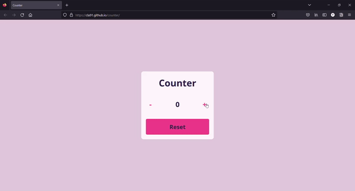

# Counter Application

This is a simple JavaScript application that lets the user increase/decrease the initial value by 1 and reset it to 0 if needed.

## Table of contents

- [Overview](#overview)
  - [Requirements](#requirements)
  - [Screenshot](#screenshot)
  - [Links](#links)
- [My process](#my-process)
  - [Built with](#built-with)
- [Contact](#contact)

## Overview

### Requirements

Users should be able to:

- increase/decrease the counter value
- as soon as the user enters the page, he will see 0 as the counter value and will have two buttons +/- available to change the counter value

### Screenshot

### Links

- Live Site URL: [github pages](https://cla91.github.io/counter/)
- Project Link - [github repository](https://github.com/cla91/counter)

## My process

### Built with

- HTML5
- CSS3
- Vanilla JavaScript

## Contact
- Claudia Cantiani - cclaudia0691@gmaill.com
- Sito web - [Claudia Cantiani | Front End Developer](https://cla91.github.io/)
- Frontend Mentor - [@cla91](https://www.frontendmentor.io/profile/cla91)
- GitHub - [https://github.com/cla91](https://github.com/cla91)
